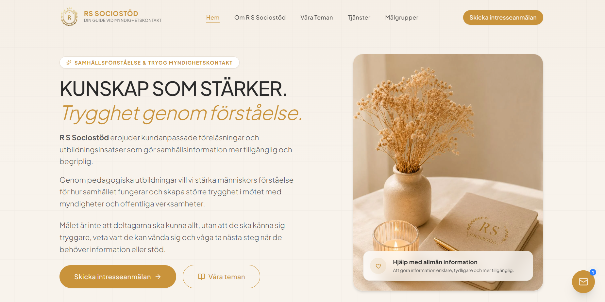

# 🚀 rssociostod - Social & Family Consultation Platform

## **rssociostod** is a premium, modern, and highly responsive landing page tailored for a professional Social Guide and Family Consultant. Designed to provide a safe, comforting, and elegant user experience, the platform enables clients to explore consultation fields, understand session workflows, and initiate direct, confidential inquiries. It features smooth micro-interactions, custom styling, and conversion-focused tracking.

## 🌐 Live Site

🔗 https://www.rssociostod.se/

---

## 📌 Features

- **Premium & Empathetic UI:** A fluid layout tailored seamlessly across Mobile, Tablet, and Desktop with warm, comforting luxury brand colors.
- **Consultation Fields Showcase:** Interactive grids highlighting areas of expertise (Family, Marriage, Personal, and Social Guidance).
- **Secure Consultation Inquiries:** Optimized multi-channel routing enabling clients to request private sessions via secure WhatsApp dynamic links or custom forms.
- **Smooth Micro-interactions:** Fluid scroll-triggered entrance animations driven by Framer Motion to enhance visual engagement.
- **Built-in Trust Indicators:** Elegant presentation of success metrics, custom client testimonials, and credentials badges.
- **Analytics & Event Tracking:** Pre-configured Google Analytics (`gtag`) hooks to track user conversions on high-intent CTA buttons.
- **100% Native RTL Layout:** Engineered from the ground up for Arabic-speaking audiences with perfect typography and spacing.

---

## 📸 Screenshots

## 

---

## 🛠️ Technologies Used

- **React.js + TypeScript** - For a component-based, type-safe architecture
- **Vite** - As a lightning-fast build tool and bundler
- **Tailwind CSS** - For complex fluid responsiveness and utility-first styling
- **Framer Motion** - To power premium micro-interactions and smooth entries
- **Lucide React & React Icons** - For clean vector icons representing guidance categories
- **Google Analytics (Gtag)** - Integrated event streams to monitor client conversion metrics

---

## 📂 Project Structure

````txt
rssociostod/
├─ src/
│  ├─ components/
│  │  ├─ ui/               # Reusable core UI components (Button, Cards, Badges...)
│  │  ├─ sections/         # Main layout blocks (Hero, Services, Testimonials, Workflow...)
│  │  └─ layout/           # Shared structures (Navbar, Footer)
│  │
│  ├─ data/               # Centralized text, categories, and content data files (content.ts)
│  ├─ styles/             # Global CSS variables and Tailwind extensions (index.css)
│  ├─ App.tsx             # Main Root Application Layout
│  └─ main.tsx            # Main Entrypoint
│
├─ public/                # Static assets, high-res advisor photography, and branding assets
├─ .env.example           # Environment variables template skeleton
├─ package.json           # Scripts, dependencies, and build configurations
└─ README.md              # Documentation Handover File

---

## 💻 Running Locally

1. Clone the repository:
```bash

git clone https://github.com/aliasaad01/R-S-Sociostod.git
cd amBean

npm install
npm run dev

---
````

## 👨‍💻 Author

**Ali Asaad**

Front-End Developer | React.js + TypeScript

- GitHub: [https://github.com/aliasaad01](https://github.com/aliasaad01)

- ⭐ If you like this project, give it a star!
